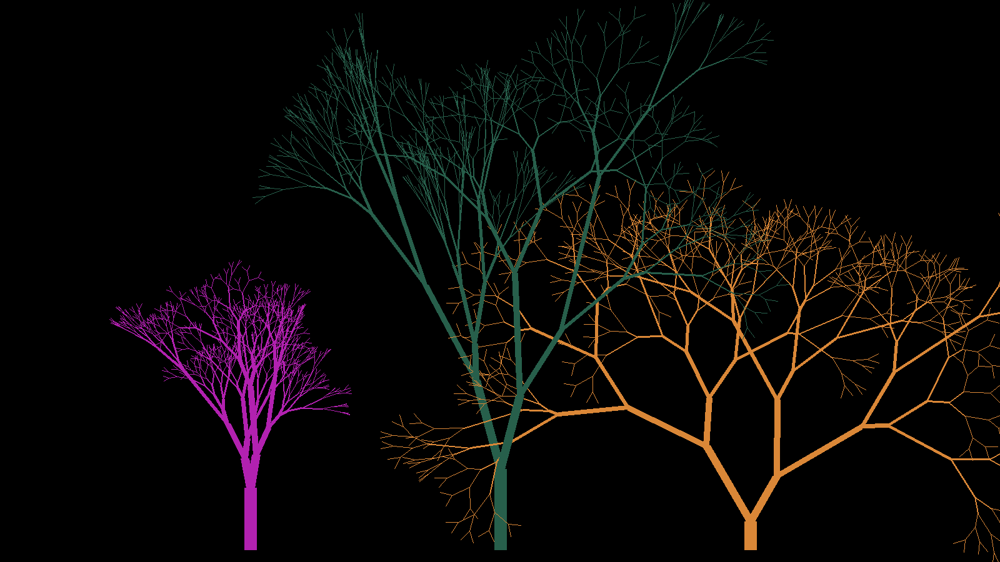

# L-system

[](https://www.python.org/)
 

2D [L-systems](https://en.wikipedia.org/wiki/L-system) visualizer by config file writed with Python and PyGame. Draws various L-trees, Fractals and other shapes step by step. Some config file included in package.

# Requirements
- Python 3
- Pip (Python's Package Manager)
- PyGame

# Instalation

- First, clone the repository.
```
git clone https://github.com/ShamansJackal/L-system.git
```
- Then, change your current directory into the l-system repository.
```
cd l-system
```
- Finally, install the requirements in the requirements file.
```
pip install pygame
```
- From here, l-system is installed.

# Usage

## Gets start
in `L-system.py` write path to config file 
```python 
CONFIG = 'Trees_random.yaml'
```
and run the `L-system.py`.

also you can change in you want change base length of one line
```python
self.step = 20 * scale
```
or in you want change speed
```python
col_frames = 1000
```


## Defined rules
What turple do, when gets command.
- `F`, `W`, `U` - draw line forward with length `self.step` 
- `F(x, y)`, `W(x, y)`, `U(x, y)` - draw line forward with length `self.step * x` and width `y`
- `S` - just move forward in length `self.step`
- `+`/`-` - rotate left/rigth by default angle (setting in constructer)
- `+(x)`/`-(x)` - rotate left/rigth by `x` rad.
- `[`/`]` - add/get statement in/out stack

## Config file structure
You should define list of turples by descripting they params, then write rulse of tranformation
```yaml
Turples: List[[X position, Y position, Default rotate angle in deg., Scale, Axiom], ...]
Rules:
    # How change genome on next generation
    <What replace>: <How to replace>
    FX: FX+FY+
    FY: -FX-FY
    +(x): +(x*1.1)F(x+4, x)
    W(x): W(x*{1..2}) # {beg..end} will select random number in [beg..end] by gauss
```

!!! Program can draw many shapes, but they need have same count of step in `self._genome` (or just comment `self.screen.fill(BLACK)`) !!!
## How it works

```
n=0:               A             start (axiom/initiator)
                  / \
n=1:             A   B           the initial single A spawned into AB by rule (A → AB), rule (B → A) couldn't be applied
                /|     \
n=2:           A B      A        former string AB with all rules applied, A spawned into AB again, former B turned into A
             / | |       | \
n=3:         A B A       A B     note all A's producing a copy of themselves in the first place, then a B, which turns ...
           / | | | \     | \ \
n=4:       A B A A B     A B A   ... into an A one generation later, starting to spawn/repeat/recurse then
Choose a self-explaining name for your project.
```


